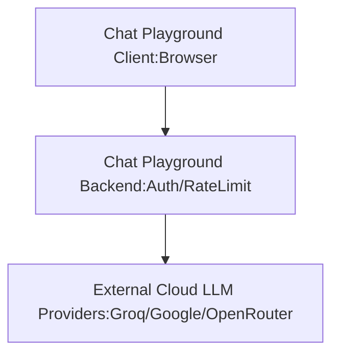
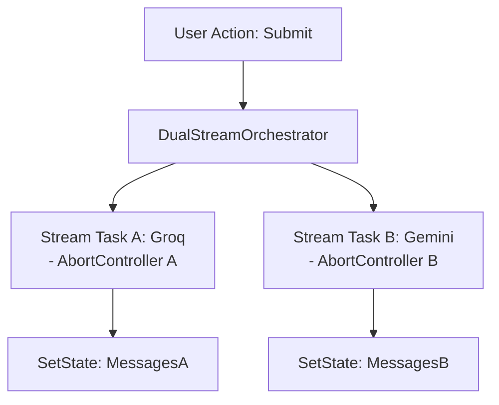

# TECHNICAL DESIGN DOCUMENT: [Dual Models Realtime Arena / LLMs Chat Playground]


| Metadata | Information |

| :--- | :--- |

| **Author** | Thoa Nguyen |

| **Status** | DRAFT |

| **Date** | 2026-10-07 |

| **Target Audience** | Staff/Principal Engineers, Engineering Leadership, Security, Product |


---


## 1. Executive Summary & Problem Statement

-  **Problem Context:** We want a visual representation of how fast/how better an LLM model / provider can response to a query vs the other.


## 2. Goals & Non-Goals

### **Goals (In-Scope):** Client-side Dual Stream Orchestration & UI Architecture

#### 1. Create a screen where user can

- Select 2 models/providers to compare performance and then send a message to both selected models and see how each selected model is responding.

- The performance of model can be measured by time to first token (TTFT), total time needed to complete anwering a query.

- User must select 2 models at a time.

- The responses from both selected model are streamed to UI at the sametime.

- Conversation stream to/from each model is managed separately

- Allow multi turn conversations on each model: user can send max 3 messages in 1 test run.

#### 2. Technical goals

- Dual Stream Concurrency: Trigger and manage both Server-Sent Events streams/Fetch Readable streams in parallel

- Fault Isolation: Connection or Rate-limit on one LLM Cloud Provider won't impact the responses and streaming response process for the other Provider.

- Independence Stream Lifecycle: Allow user to abort (stop) the stream for each Clould LLM provider seperately. Possible to allow user to stop both streams at the same time.

### **Non-Goals (Explicitly Out-of-Scope):**

- Do not allow users to select more than 2 models to compare performance.

- Do not save chat history to Database

- Do not support modification of System Prompt

- Do not support System Prompt per model per time.


## 3. High-Level Architecture & System Boundaries

-  **System Topology:** High-level component diagram (Mermaid/ASCII/Image link).



-  **Data Flow & Lifecycle:** Sequential workflow from initial request dispatch to terminal state handling.



-  **State Management:** State for Arena to manage model selection and 2 streams from 2 different models/providers.


```TypeScript

export  type  Role = "user" | "assistant" | "system";


export  interface  MessageUsage {

prompt_tokens: number;

completion_tokens: number;

total_tokens: number;

}


export  interface  Message {

role: Role;

content: string;

usage?: MessageUsage | null;

}


export  interface  StreamChatParams {

provider: string;

model: string;

messages: Message[];

temperature: number;

outChunk: (chunk_: string) =>  void;

onUsageComplete?: (usage: MessageUsage) =>  void;

signal?: AbortSignal;

}


export  interface  ModelInfo {

id: string;

name: string;

provider_id: string;

context_window?: number;

description?: string;

}


export  interface  ProviderInfo {

id: string;

name: string;

is_active: boolean;

models: ModelInfo[];

}


export  interface  StreamMetrics {

startTime: number;

timeToFirstTokenMs?: number;

totalDurationMs?: number;

tokensPerSecond?: number;

usage?: MessageUsage;

}


export  type  StreamStatus = "idle" | "streaming" | "completed" | "error";


export  interface  SingleStreamState {

llmModel: ModelInfo | null;

messages: Message[];

status: StreamStatus;

metrics?: StreamMetrics | null;

error?: string | null;

}


export  interface  DualModelArenaState {

streamA: SingleStreamState;

streamB: SingleStreamState;

}


```


## 4. Architectural Alternatives & Trade-Off Analysis


| Evaluation Criteria | Option A: [Direct Client side Streaming] | Option B: [Backend Proxy Gateway] |

| :--- | :--- | :--- |

| **Architecture Summary** |Browser (Client) post request directly to 3rd party LLM Cloud provider using client-stored API keys| Browser calls a central Backend Proxy which handles authentications and streams tokens back to client. |

| **Pros** | - Lowest latency (no extra network hop) - No Backend's server cost. - Simple architecture, serverless. | - Higher API Keys securities - Centralized Rate limiting & audit logging - Bypasses all browsers CORS restrictions natively |

| **Cons & Risks** | - High security risk, API keys are exposed to client side in Local Storage - Vulnerable to Client-side CORS issues if Providers change headers - Hard to enforce global usage quotas across users | - Added latency (extra network hop through proxy) - Added server cost. - Backend become a single point of failure. |

| **Latency / Throughput Impact** | Minimal latency. TTFT depends strictly on client network and Provider response time. | Higher TTFT due to proxy hop and server buffer overhead |

| **Operational & Maintenance Cost**| Minimal, only client side host. | Increase in linear with number of active users. |


-  **Architectural Decision Record (ADR):** We select Option B as we currently have a backend that handles Cloud Providers LLMs calls and it supports future growth. In addition to that securing the API keys are important.


## 5. Non-Functional Requirements (NFRs) & Cost Profile

### **Performance Targets:**

- UI frame rate >= 50 fps while receiving tokens from both streams.

- When user close tabs or reset Dual Arena test, current messages, and listeners must be reset to avoid memory leak.

### **Security & Data Privacy:**

- API Key Security: Zero API keys exposed or stored on the client. Auth handled via HTTP-Only session cookies or Bearer tokens sent exclusively to the Backend Proxy Gateway.


- Prompt Data Retention: Ephemeral client state only; zero local persistence of chat messages in LocalStorage or IndexedDB.

### **Cost Estimation:**

- Only levarage free quotas from Cloud Providers.


## 6. Resilience, Failure Modes & Edge Cases

### **Failure Matrix:**

#### Downstream Provider outage:

-  **Failure Isolation:** In case responses from one of the model has issues HTTP 500/503 then the other stream is not being impacted.

-  **Graceful Degration:** Show local error on stream that has error

	- **Timeout /Circuit Breaker:**

		Abort after 15 seconds of no-responses from downstream provider. TTFT: if TTFT >10s, abort.

		Inter token idle, timeout: in the middle of streaming back tokens from backend, if time to next token is greater than 10s --> abort, flush buffer.

	- **Rate-limiting (HTTP 429)**: Show local error on stream that has the error and abort after 15 seconds.

	- **Partial failure handling:** In case stream disconnects, network jitter: Show local error and Abort after 15 seconds of no responses

-  **Degradation Strategy:** How does the system fail safely without breaking the global application state?

	-	Throughput Asymetry:

		- Risk: Groq can have high token generation speed (300t/s) while Google Gemini can have lower token generation speed (30t/s). This might cause UI glitch if being put side-by-side. so each chat stream should handle own div overflow.

		- Solution: Component of Stream A and B are rendered and re-rendered separately.

	- Request Cancellation Lifecycle:

		-	Provide 2 intances of AbortController for each stream: abortController A and abortControllerB. User can abort stream individually or abort both streams at the same time.

-  **Edge cases:**

	*- IME Text Composition:* Intercept form submission if e.nativeEvent.isComposing === true (prevents premature trigger on Vietnamese/Japanese input).
	*- Auto-scroll Layout Thrashing:* Enforce overflow-anchor: auto or throttle scroll triggers via requestAnimationFrame to prevent UI freeze at high token throughput (e.g., Groq 300 t/s).


## 7. Rollout Strategy, Observability & Telemetry

-  **Deployment Strategy:** Feature flag toggles, phased percentage rollouts, rollback triggers.

	- Nothing specific as the app is at demo stage.

-  **Observability:** Telemetry metrics, structured logging format, client/server error tracking.

	- Console Telemetry:

		-  Log data in json format of ({ model_id, ttft_ms, total_latency_ms, tps, status }) to Client Console.

		- In case of error or exception: log error and exception to Client Console.
